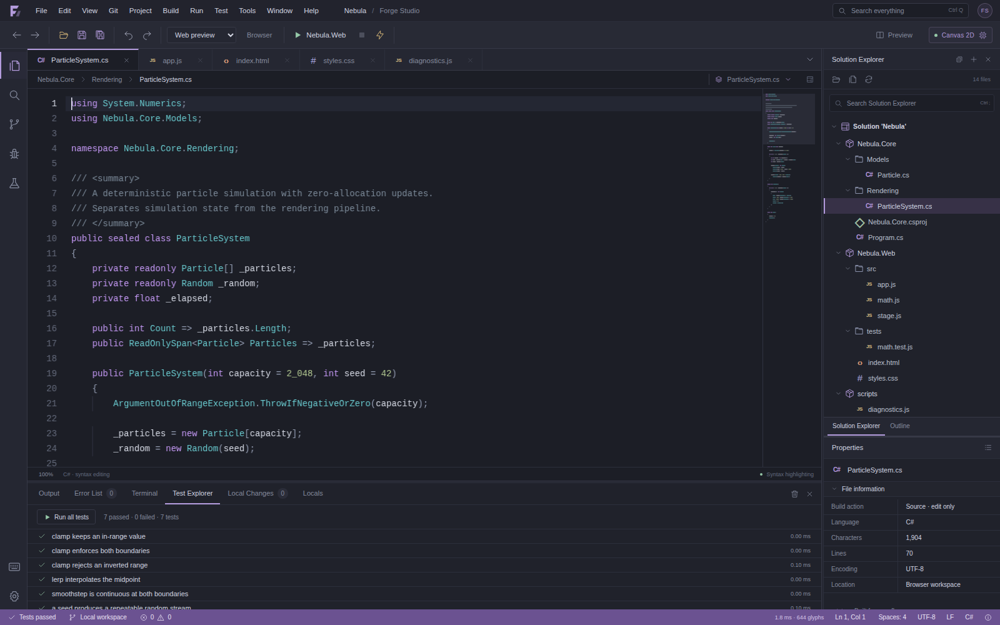

# Forge Studio

A runnable, framework-free browser IDE with a Visual Studio-inspired desktop workspace and a custom WebGPU code editor. It includes actual source editing, local workspaces, JavaScript diagnostics and execution, an isolated browser preview, a test runner, and a top-level JavaScript trace debugger.

**No React, Monaco, CodeMirror, build service, account, CDN, or package installation is required to run the app.** The only vendored third-party runtime code is Acorn 8.15.0, used to parse JavaScript. Its MIT license is included in `vendor/ACORN-LICENSE`.

This is an independent implementation with original branding. It is not affiliated with Microsoft and is **not a complete replacement for native Visual Studio**. The capability boundaries below are part of the implementation contract, not simulated features.



## Start

### Portable HTML

Open `ForgeStudio.html` in a modern browser. It contains the app, CSS, parser, language worker, and sample workspace in one file, with no external asset requests. Browser rules for local-file storage, clipboard access, and GPU access vary. Use the local-server option for normal development.

### Local server — recommended

From this directory:

```sh
python3 tools/serve.py
```

Open `http://localhost:8080`. Change the port with `python3 tools/serve.py --port 8090`. The server binds to `127.0.0.1`, not the public network. Alternatively, serve the directory using any static HTTP server or HTTPS hosting provider. The app uses relative paths and works under a hosting subdirectory.

WebGPU is selected automatically when a device is available. The renderer badge displays the **actual** backend. `http://localhost:8080/?canvas` forces Canvas 2D for comparison. WebGPU is a secure-context API; merely serving this app over an arbitrary remote HTTP origin does not enable it. See [MDN's GPU entry-point documentation](https://developer.mozilla.org/en-US/docs/Web/API/Navigator/gpu).

The included source is already runnable; rebuilding the portable HTML is optional:

```sh
node tools/build-standalone.mjs
# or: npm run build:standalone
```

Node 22 or newer is used for the development tools. Node is not required by the browser app or the Python static server.

## First session

The initial **Nebula** solution includes a C# particle model, a working HTML/CSS/JavaScript particle application, seven executable JavaScript tests, and a standalone tracing example.

| Action | Shortcut or menu | What actually happens |
|---|---|---|
| Run web project | F5 | Loads the local web project inside a sandboxed preview and connects its console output. |
| Run current JavaScript | Ctrl+F5 | Imports the active JS module in an isolated worker, resolving local module dependencies. |
| Validate | Ctrl+Shift+B | Parses JavaScript and JSON in the language worker; lists syntax errors. Does not compile C#. |
| Run sample tests | Test → Run all tests | Executes seven assertions-based tests from `Nebula.Web/tests/math.test.js`. |
| Trace a script | Open `scripts/diagnostics.js`, F9 | Pauses before top-level JavaScript statements. F10 steps and F8 continues. |
| Stop execution | Shift+F5 | Removes preview sessions and terminates script workers. |
| Find a file | Ctrl+P | Fuzzy-searches actual workspace paths. |
| Commands | Ctrl+Shift+P | Searches the shared command registry. |
| Settings | Ctrl+, | Switches theme, font size, indentation, minimap, accessibility, and live reload. |

Most Ctrl editing commands also accept Command on macOS. Browser/OS-reserved shortcuts may intercept some combinations; every core action remains accessible through menus.

## Implemented capabilities

### Workspace and user interface

The workbench includes a menu bar, run toolbar, document tabs, breadcrumbs, activity rail, Solution Explorer, document outline, properties, resizable panels, a split web preview, and dark/light themes. Menus and shortcuts share one command registry rather than separate stub handlers.

Files can be created, opened, renamed, removed from the virtual workspace, searched, and exported. Open tabs are reorderable. The interface includes Output, Error List, Terminal, Test Explorer, Local Changes, and Locals panels. Quick-open and command palettes support keyboard navigation. An accessible native-textarea mode exposes the full source document to assistive technology.

### Text editing and rendering

The document model uses a UTF-16 indexed piece-table treap with subtree character/newline measures. Undo/redo stores reversible edits, selections, and revision identities; typing coalesces without crossing saved checkpoints. Navigation and deletion use grapheme segmentation. The editor supports selection, clipboard events, IME composition, automatic pairs, indentation, comments, line duplication/movement, literal find/replace, completion lists, lexical definition lookup, and a minimap.

The WebGPU path draws **the code itself**, along with gutters, selections, diagnostics, guides, and the minimap. It uses a dynamic glyph atlas and a single instanced quad stream, not a DOM code layer placed over a decorative GPU canvas. Canvas 2D consumes the same display list when WebGPU is unavailable or fails.

Syntax coloring covers C#, JavaScript, TypeScript, HTML, CSS, XML/XAML/AXAML, JSON, Markdown, WGSL, and YAML, with plain-text fallback. The tokenizer is lightweight and is not a complete grammar for every language. Suggestions and definition lookup are lexical, not semantic IntelliSense.

### Execution and diagnostics

JavaScript and JSON receive actual parser diagnostics. JavaScript symbols come from the parsed AST; other supported languages use a basic symbol scanner. Analysis is debounced and version checked to avoid applying stale results.

The browser preview resolves local JavaScript modules and CSS and runs inside an opaque-origin iframe. JavaScript execution, tests, and tracing run in terminable workers created by a separate sandboxed iframe. Their output and errors are relayed into the IDE. The terminal provides workspace commands and isolated JavaScript evaluation, **not an operating-system shell**.

### Save, recover, and export

Auto-recovery writes a snapshot to IndexedDB after a 650 ms debounce. It does not silently overwrite files on disk. Explicit Save also writes retained local file handles when a folder was opened through the File System Access API. File handles are intentionally not restored from backups or across page reloads: reopen the folder to reauthorize disk writes.

Export a `.forge.json` backup to preserve source, tab order, selections, scroll positions, saved-state information, and the local-change baseline. Export Project ZIP creates a UTF-8 STORE-format ZIP with CRC32 checksums. Export Current File preserves the document's LF/CRLF choice.

Local Changes compares source against a user-controlled snapshot baseline. It tracks modifications, additions, and deletions; a rename appears as a deletion plus addition. **It is not a Git repository, staging index, or commit history.**

IndexedDB recovery is local to a browser origin. Clearing site data, private browsing policies, quota limits, or changing the hosting origin can make saved data unavailable. Export backups regularly. Undo history and active execution state do not persist across reloads.

## Explicit capability boundaries

C#/XAML/AXAML and TypeScript are editable source, not compiled workloads. There is no Roslyn service, MSBuild, NuGet restore, CLR runtime, TypeScript emitter, XAML designer, native debugger, Debug Adapter Protocol host, or operating-system terminal in this build. `.csproj` files are text documents; solution folders are not an evaluated MSBuild project graph.

The trace debugger pauses only before standalone script **top-level statements**, with initialized top-level bindings. It does not step into functions or provide a VM call stack, arbitrary lexical scope inspection, or native breakpoints. Modules with imports/exports use normal execution instead of trace mode.

The virtual loader supports local `.js`, `.mjs`, and JSON modules and literal dynamic imports. Bare package imports, network dependencies, computed imports, JSX, CommonJS `require`, and package installation are not supported. Worker execution rejects module cycles; browser preview import maps support local cyclic graphs. JSON modules are synthesized as JavaScript default exports rather than native import-attribute JSON modules.

The preview is intentionally local-only: network requests and external dependencies are blocked by its CSP. Local CSS is inlined, but asset bundling, `url()` rewriting, external fonts, binary resource imports, and full import-map configuration are not implemented. No AI assistant, extension marketplace, collaboration backend, semantic refactoring engine, multicursor model, folding engine, or complete bidirectional/shaping engine is included.

## Validation

**19 core tests passed**, including 4,000 randomized UTF-16 edits, 100,000-line buffer lookup, undo/save revisions, lexer state invalidation, workspace import validation, AST-based module rewriting, trace instrumentation, and ZIP structure/CRC32.

**28 Chromium integration checks passed** against the portable HTML, including keyboard editing, undo/redo, auto-pairing, grapheme deletion, accessibility mode, completions, real syntax diagnostics, script execution, tracing and locals, preview interaction, themes, and independent ZIP export verification. The bundled sample's **7 JavaScript tests passed inside the app**.

The test environment permitted offline DOM injection but blocked ordinary browser URL navigation. Browser verification therefore exercised **Canvas 2D on an opaque origin**, not a secure-context WebGPU device. Hardware WebGPU, IndexedDB recovery, native directory selection/writeback, and cross-browser IME/screen-reader interoperability were **not verified here**. No hardware performance benchmark is claimed. The renderer status reports CPU display-list/command-encoding time, not GPU completion time or end-to-end input latency.

Run the core suite with `npm test` or `node --test tests/*.test.js`. See [Testing](docs/TESTING.md), the [raw core test log](docs/core-test-results.txt), and [browser integration results](docs/browser-test-results.json).

## Source organization

```text
index.html / styles.css          Desktop workbench and design tokens
src/app.js                      Command registry, workspace UI, integration
src/core/text-buffer.js          Piece treap, document revisions, edit history
src/core/workspace.js            Files, persistence, baselines, disk save
src/core/languages.js            Stateful coloring, symbols, completions
src/core/analysis.js             Versioned worker requests
src/workers/language-worker.js   JS AST / JSON diagnostics
src/core/runtime.js              Virtual modules, sandbox, tests, trace
src/core/search.js               Literal search and bounded line diff
src/core/zip.js                  CRC32, ZIP writer, downloads
src/editor/editor.js            Input, selection, viewport, code rendering
src/render/surface.js            WebGPU glyph pipeline and Canvas fallback
src/demo.js                     Runnable Nebula example workspace
vendor/acorn.mjs                Pinned JavaScript parser
```

The implementation and extension seams are documented in [Architecture](docs/ARCHITECTURE.md). MIT licensed; see `LICENSE` and the vendored parser's license.
